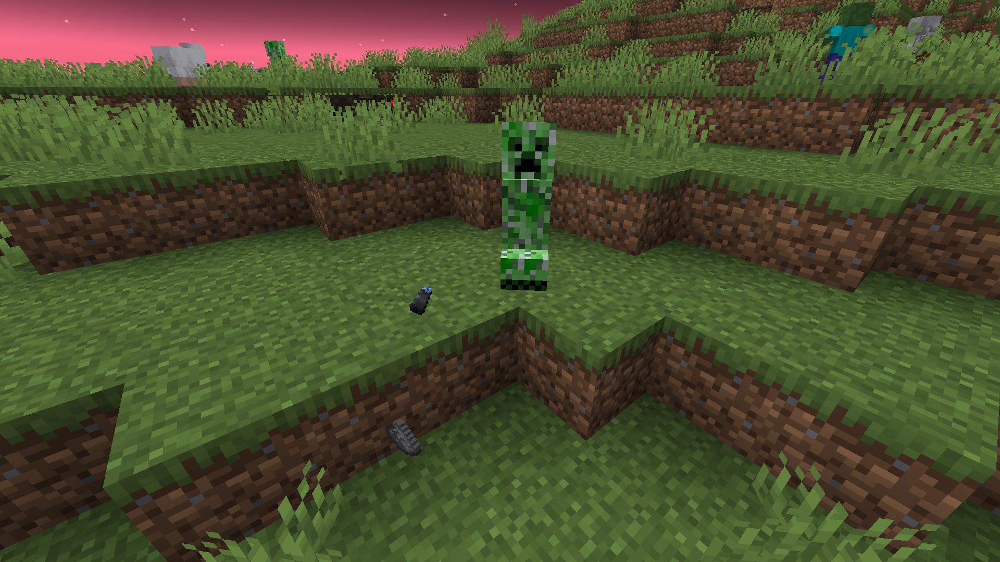

# DiscFragments
各レコードの破片を追加するマインクラフトのデータパックです。


何故レコードの破片が「5」しか無いのか？と思ったので、このデータパックを作成しました。

## 特徴
- クリーパーがスケルトンの矢で倒される、チェストの中から獲得する以外の方法でレコードの破片を入手でき、9個集めるとそのレコードにクラフト出来ます。
- レコード集めが少し楽になるかもしれません。

## レコードの破片の入手方法
### 11, 13, blocks, cat, chirp, far, mall, mellohi, stal, strad, wait, ward
- クリーパーがプレイヤーに倒された際に25%（ドロップ増加1レベルに付き+10%）の確率で蒸気のレコードの破片のいずれか1つをドロップします。

  

- 11, catはモンスタースポナーのチェストからも獲得出来ます。

  

### otherside
- モンスタースポナーのチェストから低確率で獲得出来ます。

### 5
- オーバーワールドでスポーンする一般的なモンスター（ゾンビ、スケルトン、クリーパー...）がプレイヤーに倒されるかつ、そのモンスターのy座標が0以下の場合に5%（ドロップ増加1レベルに付き+2%）の確率で1つドロップします。

### pigstep
- ピグリン、ゾンビ化ピグリンがプレイヤーに倒された際に5%（ドロップ増加1レベルに付き+2%）の確率で1つドロップします。
- 野蛮なピグリンの場合は、プレイヤーに倒されると50%の確率でドロップします（ドロップ増加による補正はありません）。
- ピグリン要塞のチェストからも獲得出来ます。

## レコードのクラフト
- クラフティングシステムの制約上、作業台でのクラフトが実装出来なかったため、代わりに、**レコードの破片を9個を地面に投げて下さい**。

  

- 「5」のレコードの破片も含め、作業台でのクラフトは**出来ません**。

## コマンド
このデータパックには、チートコマンドが有効な場合に実行可能なコマンド（関数）が登録されています。

### ```/function disc_fragments:give_fragment_<レコード名>```
指定したレコードの破片を9個、コマンド実行者に与えます。

## 導入方法
[こちら](https://github.com/Gakuto1112/DiscFragments/releases/tag/v1.0.0)より、データパックとリソースパックをダウンロードしてお手持ちのワールドに適用させてください。尚、データパックやリソースパックの導入方法は、他サイト様を御参照ください。